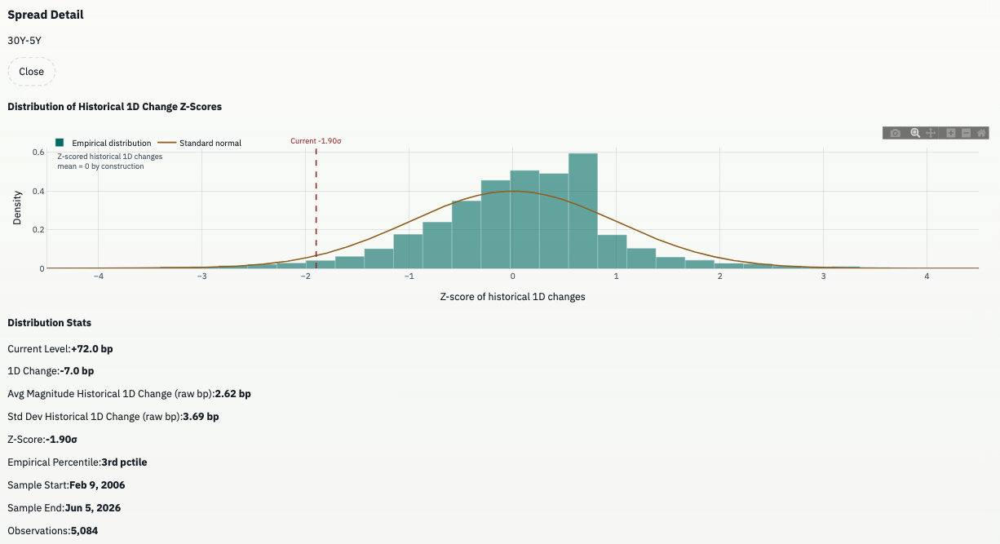

# U.S. Treasury Yield Curve Dashboard

Static frontend dashboard for inspecting U.S. Treasury yield curves and Treasury marketable-security auction issuance from a browser, with no backend and no database.

I built this with Codex for daily personal use, because I prefer a plot to a table and I wanted a more customizable version of https://www.ustreasuryyieldcurve.com/ for following U.S. Treasury yields. 

It's a simple, locally run web app with two pages:

- `index.html`: yield curve comparison, configurable spread and butterfly monitors, maturity time series, and PCA.
- `issuance.html`: TreasuryDirect auction issuance, demand, bidder allocation, and upcoming supply.

The yield dashboard fetches the latest history from the [Official U.S. Treasury Daily Treasury Par Yield Curve Rates page](https://home.treasury.gov/resource-center/data-chart-center/interest-rates/TextView?type=daily_treasury_yield_curve). The issuance dashboard fetches Treasury marketable-security auction data from TreasuryDirect.


## Data Source

Live fetch path used by the app:

- [Official paginated Treasury XML feed for the full history](https://home.treasury.gov/resource-center/data-chart-center/interest-rates/pages/xml?data=daily_treasury_yield_curve&field_tdr_date_value=all&page=0)
- [TreasuryDirect auction query JSONP feed](https://www.treasurydirect.gov/TA_WS/securities/jqsearch?format=jsonp&pagenum=0&pagesize=1000)

Fallbacks:

- `data/sample_treasury_yields.csv` bundled with the project
- drag-and-drop CSV upload
- file picker upload

## How To Run

To run it in the background without needing to restart from the terminal, from the project directory:

```bash
nohup python3 -m http.server 8000 > server.log 2>&1 &
```

Then open:

- [http://localhost:8000](http://localhost:8000)
- [http://localhost:8000/issuance.html](http://localhost:8000/issuance.html)

To stop it later:
```bash
lsof -i :8000
kill -9 <PID>
```

## Dashboard Behavior

### Pages And Navigation

- `index.html` is the Yield Curve page.
- `issuance.html` is the Issuance page.
- The page navigation at the top of each dashboard switches between the two.

### Historical Comparison

- Compare the latest curve against a selected date.
- Add multiple historical overlays.
- Presets include latest, 1 day, 1 week, 1 month, 3 months, 1 year, max steepening, and max inversion.
- Show or hide the basis-point difference chart for latest minus selected.


`max steepening` and `max inversion` are based on the `2s10s` spread in the loaded sample, implemented as `10Y - 2Y`.

### Spread Summary

The spread cards are configurable. Defaults are:

- `2s10s`: `10Y - 2Y`
- `5s30s`: `30Y - 5Y`
- `2s5s10s`: `2 * 5Y - 2Y - 10Y`


Controls let you add:

- Two-leg spreads, calculated as `first leg - second leg`.
- Butterfly spreads, calculated as `2 x second leg - first leg - third leg`.

Each card shows:

- Current spread or butterfly value in basis points.
- One-day change in basis points, computed versus the prior available Treasury observation.
- The one-day move's z-score and empirical percentile versus the historical distribution of post-2006 one-day changes.
- A directional interpretation such as normal steepening, significant flattening, belly cheapening, or belly richening.
- The latest available date.
- A compact sparkline.

Clicking a card opens a spread detail panel that shows the normalized empirical distribution of historical one-day changes for the selected spread. The chart uses 50 bins, fixes the x-axis to z-scores from `-4.5` to `4.5`, overlays a standard normal curve, and marks both zero and the current move's z-score.

Distribution stats include:

- Current level.
- Current one-day change.
- Mean magnitude and standard deviation of historical one-day changes.
- Z-score.
- Empirical percentile.
- Post-2006 sample start and end dates.
- Observation count.

Selected cards persist in local storage. `Reset Defaults` restores `2s10s`, `5s30s`, and `2s5s10s` and closes the spread detail panel.




### Historical Yields

- Time series of selected maturity yields.
- Defaults to the latest 1-year window.
- Range buttons expand the visible window to 5 years, 10 years, or all history.
- `Visible-Window Y` is enabled by default and scales the y-axis to the selected time window.
- `Full-Series Y` is still available if you want a constant y-axis across all loaded history.
- `Auto Fit Visible Y` fits the y-axis to the data in the currently selected window, not the entire historical series.


### Treasury Issuance Dashboard

The Issuance page is `issuance.html`. It loads recent marketable-security auction rows from TreasuryDirect's auction query service and keeps the dashboard fully static in the browser.

The page includes:

- Summary cards for gross offering amount, completed auction count, weighted average bid-to-cover, indirect bidder share, and announced upcoming offering amount.
- Filters for completed lookback window, security type, announced auctions, and reopenings.
- Monthly offering by security type.
- Bid-to-cover versus offering size.
- Accepted bidder allocation across primary dealers, indirect bidders, and direct bidders.
- Offering amount by term.
- Upcoming auction table with announcement/result links where TreasuryDirect provides file names.
- Recent auction tape for completed auctions.
- CSV export for the currently filtered auction rows.

## PCA Loadings

Method used in `js/pca.js`:

1. Build the historical daily matrix from maturities with sufficient coverage.
2. Use a coverage threshold to select common maturities across the sample.
3. Drop rows with missing values across the chosen PCA maturities.
4. Mean-center each maturity series across time.
5. Compute the covariance matrix of the centered matrix, either on yield levels or on daily first differences.
6. Extract the top 3 eigenvectors from the singular vector matrix after performing SVD.
7. Compute score time series for PC1, PC2, and PC3.
8. Orient component signs toward the usual fixed-income interpretation:
   - PC1: level / parallel shift
   - PC2: slope / steepener
   - PC3: curvature / twist

### Regime-Aware PCA

You can choose:

- `Full Sample`: stable long-run basis across all complete rows
- `Rolling Window`: trailing-window PCA recomputed for each date
- `Custom Date Range`: PCA fit only on the chosen start/end window
- `Preset Regimes`: named environment classifications such as `Tightening Cycles`, `Crisis Easing`, `ZLB / QE`, `Restrictive Plateaus`, `Transitional / Anomalous`, and `All History`

Preset regimes can span multiple disjoint windows. The PCA fit uses the union of those windows only.

### Levels Vs Daily Differences

- `Levels`: fit PCA on the yield curve level matrix after mean-centering. Captures the dominant structure of the curve level across time.
- `Daily Differences`: fit PCA on first differences of yields, maturity by maturity, after mean-centering the differenced matrix. Useful when secular trend shifts dominate the sample and you want to isolate day-to-day co-movement instead.

#### Why Care About This?

Let's look at the 2022–2023 rate hiking cycle. From a macro perspective:

- The FED executed one of the fastest hiking cycles in decades
- The entire yield curve moved upward
- At the same time, the curve inverted significantly, so you might expect slope (PC2) to become more important

But when you run PCA on yield levels over this window, you see:


PC1 dominates (~96.2% of variance)
PC2 collapses (~3.2% of variance)
PC3 negligible (~0.5%)

This looks off. Why is the steepening axis capturing so little variance? In a hiking cycle, we expect the front end to be more volatile than the tail, and so we would expect PC2 to capture more variance.

But during 2022–2023, the PC1 scores were consistently rising:


i.e. there was a large, persistent upward shift in rates across all maturities, which we can also see here:


Even though the curve inverted, those slope changes were small relative to the total level shift.

So PCA assigns almost all variance to PC1 (level).

When we switch the transformation to Daily Differences.

This removes the long-term trend and focuses on day-to-day co-movement.

In the same 2022–2023 window, we now observe:


PC1 drops (~81.0%)
PC2 increases meaningfully (~10.5%)
PC3 becomes visible again (~4.9%)

This reflects the fact that day-to-day moves during the hiking cycle were not purely parallel shifts

Levels PCA captures macro regime shifts dominated by large structural repricing, while Daily Differences PCA captures more trading-relevant dynamics of how different parts of the curve move relative to each other.

### Preset Regimes

It is interesting to compare the regime-dependent PCs to the global baselines.

For example, lets use the preset regime "Tightening Cycles - Bear Flattener", where the included windows are: 2004–2006, 2016–2018, 2022–2023.

In these environments, what would we expect to see in the level PCs?
- Policy expectations get repriced, and these are embedded in the short-end (1M-2Y), so we expect the head to rise sharply. 
- THe long end yields (10Y-30Y) are rising, but more modestly because theyre constrained by long-run inflation expectations, growing recession risk, etc. So what does this imply for the covariance structure between yields (what the PCs capture)?
- Variance gets concentrated at the front end and movements get less uniform across maturities. So what do we expect from the level PCs:

-PC1 (shift): tilt toward shorter maturities, since most of the cross sectional variance is driven by the front end repricing rather than parallel shift across the curve.

-PC2 (Slope): Would become sharper and more front-end driven, plateauing in the long maturities to capture the divergence between rising short rates and stable long rates

-PC3 (Curvature): Would expect the hump to shift forward to reflect the biggest local distortion occuring between 2Y-5Y yields.


We see exactly this, relative to the all-data baseline. 

Some more examples of preset regimes:

Crisis Easing - Bull Steepener (2000–2003, 2007–2008):

Levels:


Diffs:


Zero-Lower bound / Quantitative Easing rate environments (2009–2015, 2020–2021):

Levels:


Diffs:


Restrictive Plateaus (2006–2007, 2023–2024):

Levels:


Diffs:


## Refreshing Data

### In the app

Yield curve data:

1. Click `Refresh Official Data`.
2. Wait for the official XML history to load.
3. If you want a replaceable local snapshot, click `Download Current CSV`.
4. Move the downloaded CSV into `data/sample_treasury_yields.csv` if you want the bundled fallback updated.

Issuance data:

1. Open `issuance.html`.
2. Click `Refresh TreasuryDirect`.
3. Use `Download Current CSV` to export the currently filtered auction rows.

### Manual fallback workflow

If live fetches are blocked:

1. Obtain an official Treasury CSV or export a normalized CSV from the dashboard.
2. Save it as `data/sample_treasury_yields.csv`.
3. Serve the project locally with `python3 -m http.server`.

## Limitations

- The `20Y` series has less historical coverage than the longer-running benchmark maturities.
- Rolling-window PCA is more computationally expensive than full-sample PCA. The app caches rolling results by transformation plus window length.
